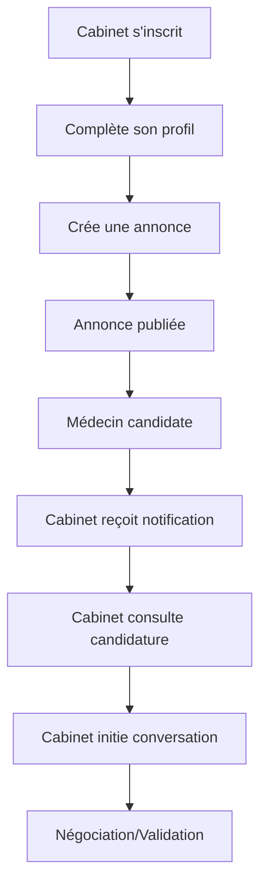
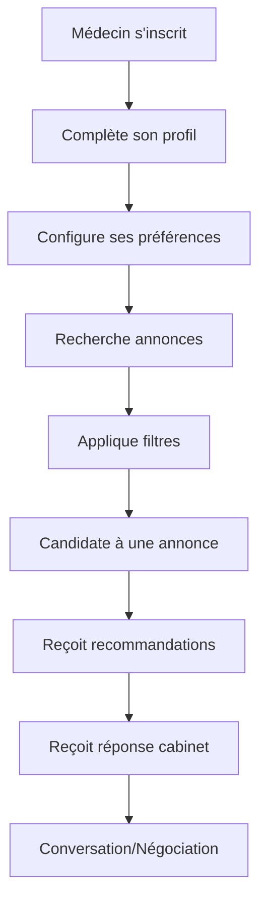

# Application de Remplacements Médicaux - Spécifications des Features

## 🎯 Vue d'ensemble du projet

**Concept** : Plateforme de mise en relation entre cabinets médicaux et médecins remplaçants, inspirée du modèle Malt.

**Stack technique** :

- Next.js 15 avec App Router
- tRPC pour l'API type-safe
- Drizzle ORM avec PostgreSQL
- NextAuth.js pour l'authentification
- shadcn/ui pour l'interface utilisateur
- Tailwind CSS pour le styling

## 👥 Architecture des rôles

### 🏥 Cabinets Médicaux

- **Rôle principal** : Publier des annonces de remplacement
- **Objectifs** : Trouver des médecins qualifiés rapidement
- **Actions** : Créer des annonces, consulter les candidatures, contacter les médecins

### 🩺 Médecins Remplaçants

- **Rôle principal** : Trouver des remplacements
- **Objectifs** : Avoir un flux régulier d'opportunités de remplacement
- **Actions** : Candidater aux annonces, recevoir des offres, gérer son profil

## 📋 Features V1 - Mise en relation et messagerie

### 🔐 Authentification et Gestion des Comptes

#### AC-01 : Inscription et connexion

- **Prérequis** : Utiliser NextAuth.js existant
- **Fonctionnalités** :
  - Inscription avec email/mot de passe
  - Connexion avec fournisseurs OAuth (Google, Discord)
  - Choix du rôle lors de l'inscription (Cabinet ou Médecin)
  - Validation d'email obligatoire
  - Gestion des mots de passe oubliés

#### AC-02 : Gestion des profils

- **Profil Cabinet** :
  - Nom du cabinet
  - Adresse complète
  - Téléphone
  - Email de contact
  - Spécialités du cabinet
  - Description du cabinet
  - Photos du cabinet (optionnel)
- **Profil Médecin** :
  - Nom, prénom
  - Spécialités médicales (multi-sélection)
  - Expérience (années)
  - Localisation préférée (rayon de déplacement)
  - CV/diplômes (upload de fichiers)
  - Disponibilités générales
  - Tarif souhaité (optionnel)

### 🏥 Gestion des Annonces (Côté Cabinet)

#### AN-01 : Création d'annonces

- **Champs obligatoires** :
  - Titre de l'annonce
  - Spécialité médicale requise
  - Localisation (intégration Google Maps API)
  - Dates de début et fin du remplacement
  - Taux de rétrocession (pourcentage)
  - Type de remplacement (urgence, planifié, récurrent)
- **Champs optionnels** :
  - Description détaillée
  - Horaires de travail
  - Nombre de patients/jour estimé
  - Matériel/équipements disponibles
  - Logement fourni (oui/non)
  - Contact préféré (téléphone/email/messagerie)

#### AN-02 : Gestion des annonces

- **Fonctionnalités** :
  - Liste des annonces actives/archivées
  - Édition des annonces
  - Suppression des annonces
  - Duplication d'annonces
  - Statistiques de visualisation
  - Gestion des statuts (brouillon, publiée, pourvue, archivée)

### 🩺 Recherche et Candidature (Côté Médecin)

#### RE-01 : Recherche d'annonces

- **Filtres de recherche** :
  - Spécialité médicale
  - Localisation (rayon géographique)
  - Dates de disponibilité
  - Taux de rétrocession minimum
  - Type de remplacement
  - Mots-clés dans la description
- **Affichage des résultats** :
  - Vue liste et vue carte
  - Tri par pertinence, date, rétrocession
  - Pagination des résultats
  - Mise en favoris des annonces

#### RE-02 : Candidature aux annonces

- **Processus de candidature** :
  - Candidature en un clic avec profil pré-rempli
  - Message de motivation personnalisé
  - Pièces jointes supplémentaires
  - Statut de candidature (envoyée, vue, acceptée, refusée)

### 🤝 Système de Matching et Recommandations

#### MA-01 : Recommandations pour les médecins

- **Algorithme de matching** :
  - Correspondance des spécialités
  - Proximité géographique
  - Disponibilités compatibles
  - Historique des rémunérations acceptées
- **Notifications de nouvelles opportunités** :
  - Alerte email pour les annonces correspondantes
  - Notification in-app
  - Fréquence configurable

#### MA-02 : Suggestions pour les cabinets

- **Médecins recommandés** :
  - Basé sur la spécialité recherchée
  - Localisation compatible
  - Disponibilités correspondantes
  - Évaluation des profils (complétude, activité)

### 💬 Système de Messagerie

#### MS-01 : Messagerie intégrée

- **Fonctionnalités** :
  - Conversations privées entre cabinet et médecin
  - Envoi de messages texte
  - Partage de fichiers (contrats, documents)
  - Statut de lecture des messages
  - Historique des conversations
  - Notifications de nouveaux messages

#### MS-02 : Gestion des conversations

- **Organisation** :
  - Liste des conversations actives
  - Recherche dans les conversations
  - Archivage des conversations
  - Indicateurs de messages non lus

### 🗺️ Intégration Géographique

#### GE-01 : Localisation et cartes

- **API Google Maps** :
  - Géocodage des adresses
  - Affichage des annonces sur carte
  - Calcul des distances
  - Autocomplétion des adresses
- **Gestion des zones** :
  - Définition de rayons de déplacement
  - Recherche par région/département
  - Affichage visuel des zones couvertes

### 📱 Interface Utilisateur

#### UI-01 : Design responsive avec shadcn/ui

- **Composants** :
  - Dashboard personnalisé par rôle
  - Formulaires de création/édition
  - Tableaux de données avec tri/filtres
  - Modales et toasts pour les notifications
  - Navigation intuitive
- **Accessibilité** :
  - Respect des standards WCAG
  - Navigation au clavier
  - Contrastes appropriés

#### UI-02 : Expérience utilisateur

- **Onboarding** :
  - Guide d'utilisation pour nouveaux utilisateurs
  - Tutoriels interactifs
  - Profil de complétion
- **Feedback utilisateur** :
  - États de chargement
  - Messages d'erreur clairs
  - Confirmations d'actions

## 🔧 Architecture Technique

### Base de Données (Extension du schema.ts existant)

```typescript
// Nouveaux modèles à ajouter :
- UserProfile (extension de User avec rôle)
- CabinetProfile (informations spécifiques cabinet)
- DoctorProfile (informations spécifiques médecin)
- JobOffer (annonces de remplacement)
- Application (candidatures)
- Conversation (messagerie)
- Message (messages individuels)
- Speciality (spécialités médicales)
- Location (données géographiques)
```

### API tRPC (Extension des routers existants)

```typescript
// Nouveaux routers à créer :
- auth (gestion des profils)
- jobOffers (CRUD annonces)
- applications (candidatures)
- messaging (conversations/messages)
- recommendations (matching)
- location (géolocalisation)
```

## 🚀 Priorisation des Features

### 🥇 Priorité 1 (MVP - 4-6 semaines)

1. **AC-01, AC-02** : Authentification et profils de base
2. **AN-01** : Création d'annonces (champs obligatoires uniquement)
3. **RE-01** : Recherche d'annonces (filtres de base)
4. **RE-02** : Candidature simple
5. **MS-01** : Messagerie de base
6. **UI-01** : Interface responsive de base

### 🥈 Priorité 2 (Améliorations - 2-3 semaines)

1. **AN-02** : Gestion complète des annonces
2. **MA-01** : Recommandations pour médecins
3. **GE-01** : Intégration Google Maps
4. **MS-02** : Gestion avancée des conversations
5. **UI-02** : Onboarding et UX améliorée

### 🥉 Priorité 3 (Optimisations - 1-2 semaines)

1. **MA-02** : Suggestions pour cabinets
2. Optimisations de performance
3. Tests et debugging
4. Documentation utilisateur

## 📊 Métriques de Succès

### KPIs V1

- Nombre d'inscriptions (cabinets et médecins)
- Nombre d'annonces créées
- Taux de candidature par annonce
- Nombre de conversations initiées
- Temps moyen de réponse aux candidatures
- Taux de complétion des profils

## 🔄 Flux Utilisateur Principaux

### Flow Cabinet → Médecin



### Flow Médecin → Cabinet



## 📚 Ressources Techniques

### APIs Externes

- **Google Maps API** : Géocodage et cartes
- **EmailJS ou SendGrid** : Notifications email
- **Cloudinary** : Stockage et optimisation d'images

### Librairies shadcn/ui à utiliser

- Form (react-hook-form + zod)
- Table (tri et pagination)
- Dialog/Modal
- Card/Badge
- Input/Select
- Button/Loading
- Toast/Alert
- Calendar/DatePicker
- Textarea
- Checkbox/RadioGroup

## 🎯 Objectifs V1

**Objectif principal** : Créer une plateforme fonctionnelle permettant aux cabinets de publier des annonces et aux médecins de postuler, avec un système de messagerie intégré.

**Critères de réussite** :

- Un cabinet peut créer et publier une annonce en moins de 5 minutes
- Un médecin peut trouver et candidater à une annonce en moins de 3 minutes
- La messagerie permet une communication fluide entre les parties
- L'interface est intuitive et responsive sur tous les appareils

---

_Ce document servira de référence pour le développement de l'application. Il sera mis à jour au fur et à mesure de l'évolution du projet._
