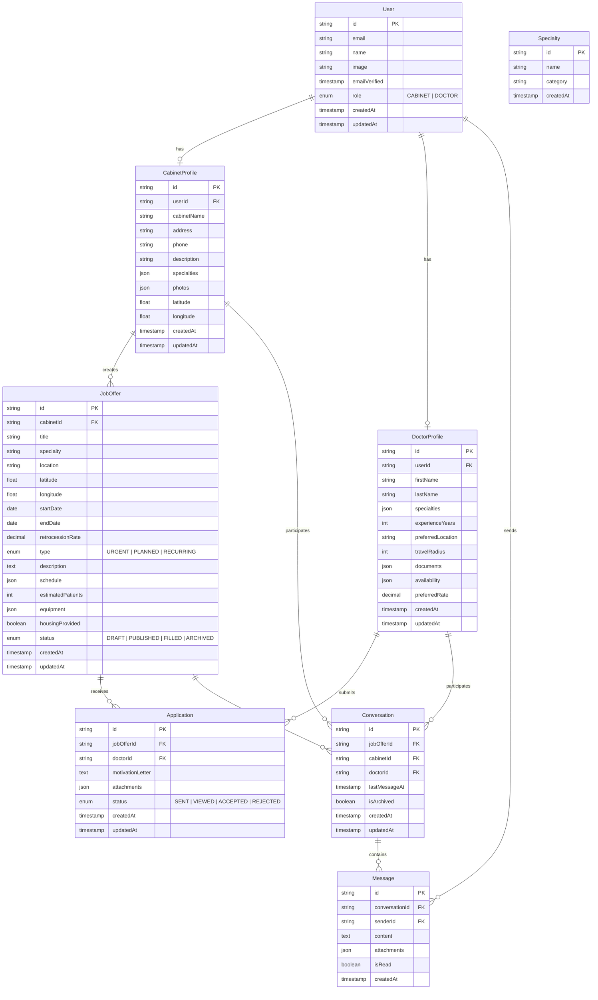
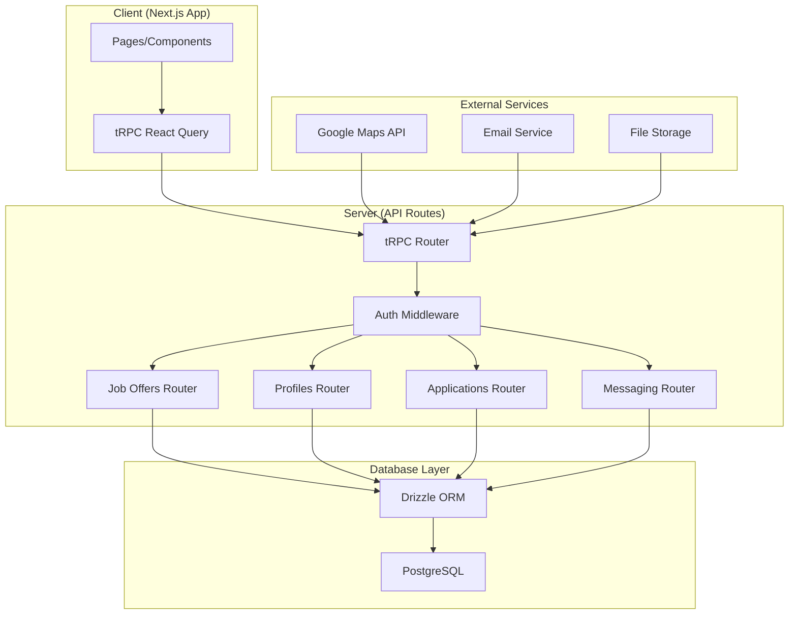
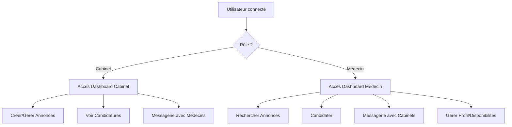

# Plan d'Implémentation - Application de Remplacements Médicaux

## 🏗️ Architecture Générale

### Stack Technique Confirmé

- **Frontend** : Next.js 15 + shadcn/ui + Tailwind CSS
- **Backend** : tRPC + Next.js API Routes
- **Base de données** : PostgreSQL + Drizzle ORM
- **Authentification** : NextAuth.js
- **Géolocalisation** : Google Maps API
- **Déploiement** : Docker + potentiellement Vercel

### Architecture des Données



## 📋 Plan d'Implémentation Phase par Phase

### Phase 1 : Fondations (Semaine 1-2)

#### 1.1 Configuration de l'environnement

- [x] Projet T3 Stack déjà configuré
- [ ] Installation et configuration de shadcn/ui
- [ ] Configuration des variables d'environnement
- [ ] Setup de la base de données PostgreSQL

#### 1.2 Authentification et rôles

- [ ] Extension du schéma utilisateur avec rôles
- [ ] Middleware pour la gestion des rôles
- [ ] Pages d'inscription avec choix de rôle
- [ ] Redirection conditionnelle selon le rôle

#### 1.3 Schéma de base de données

- [ ] Création des tables principales
- [ ] Relations entre les entités
- [ ] Migrations Drizzle
- [ ] Seeders pour les spécialités médicales

### Phase 2 : Profils Utilisateurs (Semaine 2-3)

#### 2.1 Profils Cabinet

- [ ] Formulaire de création de profil cabinet
- [ ] Validation des données (Zod schemas)
- [ ] Upload et gestion des photos
- [ ] Géocodage des adresses

#### 2.2 Profils Médecin

- [ ] Formulaire de création de profil médecin
- [ ] Sélection multiple des spécialités
- [ ] Upload de CV et documents
- [ ] Configuration des zones de déplacement

#### 2.3 Interface utilisateur

- [ ] Dashboard Cabinet
- [ ] Dashboard Médecin
- [ ] Composants shadcn/ui personnalisés
- [ ] Navigation responsive

### Phase 3 : Gestion des Annonces (Semaine 3-4)

#### 3.1 Création d'annonces (Cabinet)

- [ ] Formulaire de création d'annonce
- [ ] Intégration Google Maps pour localisation
- [ ] Validation des données
- [ ] Gestion des brouillons

#### 3.2 Gestion des annonces

- [ ] Liste des annonces actives
- [ ] Édition des annonces
- [ ] Changement de statut
- [ ] Statistiques de base

#### 3.3 API tRPC

- [ ] Router `jobOffers` avec CRUD complet
- [ ] Mutations pour création/édition
- [ ] Queries pour récupération des données
- [ ] Validations côté serveur

### Phase 4 : Recherche et Candidature (Semaine 4-5)

#### 4.1 Recherche d'annonces

- [ ] Interface de recherche avec filtres
- [ ] Queries tRPC pour la recherche
- [ ] Pagination des résultats
- [ ] Vue liste et vue carte

#### 4.2 Candidature

- [ ] Formulaire de candidature
- [ ] Gestion des pièces jointes
- [ ] Notifications de candidature
- [ ] Suivi des candidatures

#### 4.3 Système de matching

- [ ] Algorithme de recommandation basique
- [ ] Suggestions personnalisées
- [ ] Filtres de compatibilité

### Phase 5 : Messagerie (Semaine 5-6)

#### 5.1 Système de messagerie

- [ ] Interface de chat
- [ ] Envoi/réception de messages
- [ ] Partage de fichiers
- [ ] Statuts de lecture

#### 5.2 Gestion des conversations

- [ ] Liste des conversations
- [ ] Recherche dans les messages
- [ ] Archivage des conversations
- [ ] Notifications temps réel

## 🔧 Détails d'Implémentation

### Configuration shadcn/ui

```bash
# Installation des composants nécessaires
npx shadcn@latest add form
npx shadcn@latest add table
npx shadcn@latest add dialog
npx shadcn@latest add card
npx shadcn@latest add input
npx shadcn@latest add select
npx shadcn@latest add button
npx shadcn@latest add toast
npx shadcn@latest add calendar
npx shadcn@latest add textarea
npx shadcn@latest add checkbox
npx shadcn@latest add badge
npx shadcn@latest add avatar
npx shadcn@latest add tabs
npx shadcn@latest add pagination
```

### Structure des Dossiers

```
src/
├── app/
│   ├── (auth)/
│   │   ├── login/
│   │   └── register/
│   ├── (dashboard)/
│   │   ├── cabinet/
│   │   │   ├── dashboard/
│   │   │   ├── profile/
│   │   │   ├── job-offers/
│   │   │   └── messages/
│   │   └── doctor/
│   │       ├── dashboard/
│   │       ├── profile/
│   │       ├── search/
│   │       ├── applications/
│   │       └── messages/
│   └── api/
├── components/
│   ├── ui/ (shadcn/ui)
│   ├── forms/
│   ├── layouts/
│   └── features/
│       ├── auth/
│       ├── profiles/
│       ├── job-offers/
│       ├── applications/
│       └── messaging/
├── lib/
│   ├── utils.ts
│   ├── validations/
│   └── constants/
├── server/
│   ├── api/
│   │   └── routers/
│   │       ├── auth.ts
│   │       ├── profiles.ts
│   │       ├── job-offers.ts
│   │       ├── applications.ts
│   │       ├── messaging.ts
│   │       └── recommendations.ts
│   └── db/
└── types/
```

### Schemas Zod Principaux

```typescript
// Job Offer Schema
export const jobOfferSchema = z.object({
  title: z.string().min(5, "Le titre doit contenir au moins 5 caractères"),
  specialty: z.string().min(1, "La spécialité est obligatoire"),
  location: z.string().min(1, "La localisation est obligatoire"),
  startDate: z.date(),
  endDate: z.date(),
  retrocessionRate: z.number().min(0).max(100),
  type: z.enum(["URGENT", "PLANNED", "RECURRING"]),
  description: z.string().optional(),
  schedule: z
    .object({
      morning: z.boolean(),
      afternoon: z.boolean(),
      evening: z.boolean(),
    })
    .optional(),
  estimatedPatients: z.number().optional(),
  housingProvided: z.boolean().default(false),
});

// Cabinet Profile Schema
export const cabinetProfileSchema = z.object({
  cabinetName: z.string().min(2, "Le nom du cabinet est obligatoire"),
  address: z.string().min(5, "L'adresse complète est obligatoire"),
  phone: z.string().regex(/^[0-9+\-\s]+$/, "Format de téléphone invalide"),
  description: z.string().optional(),
  specialties: z
    .array(z.string())
    .min(1, "Au moins une spécialité est requise"),
  photos: z.array(z.string()).optional(),
});

// Doctor Profile Schema
export const doctorProfileSchema = z.object({
  firstName: z.string().min(2, "Le prénom est obligatoire"),
  lastName: z.string().min(2, "Le nom est obligatoire"),
  specialties: z
    .array(z.string())
    .min(1, "Au moins une spécialité est requise"),
  experienceYears: z.number().min(0).max(50),
  preferredLocation: z
    .string()
    .min(1, "La localisation préférée est obligatoire"),
  travelRadius: z.number().min(1).max(500),
  documents: z.array(z.string()).optional(),
  availability: z.object({
    monday: z.boolean(),
    tuesday: z.boolean(),
    wednesday: z.boolean(),
    thursday: z.boolean(),
    friday: z.boolean(),
    saturday: z.boolean(),
    sunday: z.boolean(),
  }),
  preferredRate: z.number().optional(),
});
```

## 🚀 Flux d'Implémentation

### Architecture tRPC



### Système de Permissions



## 📊 Métriques et Monitoring

### KPIs Techniques à Suivre

- Temps de chargement des pages
- Taux d'erreur des APIs
- Performance des requêtes base de données
- Utilisation des ressources serveur

### KPIs Fonctionnels

- Nombre d'inscriptions par semaine
- Taux de complétion des profils
- Nombre d'annonces créées
- Taux de candidature par annonce
- Nombre de conversations actives

## 🔧 Configuration et Déploiement

### Variables d'Environnement

```env
# Base de données
DATABASE_URL="postgresql://..."
DIRECT_URL="postgresql://..."

# Authentification
NEXTAUTH_SECRET="..."
NEXTAUTH_URL="http://localhost:3000"

# OAuth Providers
DISCORD_CLIENT_ID="..."
DISCORD_CLIENT_SECRET="..."
GOOGLE_CLIENT_ID="..."
GOOGLE_CLIENT_SECRET="..."

# Google Maps
GOOGLE_MAPS_API_KEY="..."

# Email
EMAIL_SERVER_HOST="..."
EMAIL_SERVER_PORT="..."
EMAIL_FROM="..."

# File Storage
UPLOAD_STORAGE_URL="..."
```

### Scripts de Démarrage

```json
{
  "scripts": {
    "dev": "next dev --turbo",
    "build": "next build",
    "start": "next start",
    "db:push": "drizzle-kit push",
    "db:studio": "drizzle-kit studio",
    "db:generate": "drizzle-kit generate",
    "db:migrate": "drizzle-kit migrate",
    "db:seed": "tsx scripts/seed.ts"
  }
}
```

## 🎯 Critères de Validation

### Tests de Validation MVP

1. **Authentification** : Un utilisateur peut s'inscrire, se connecter et choisir son rôle
2. **Profils** : Un cabinet et un médecin peuvent créer et compléter leur profil
3. **Annonces** : Un cabinet peut créer une annonce avec tous les champs obligatoires
4. **Recherche** : Un médecin peut rechercher et filtrer les annonces
5. **Candidature** : Un médecin peut candidater à une annonce
6. **Messagerie** : Cabinet et médecin peuvent échanger des messages

### Checklist Pre-Launch

- [ ] Tests d'intégration sur tous les flux principaux
- [ ] Validation mobile/responsive
- [ ] Tests de performance
- [ ] Sécurité des données
- [ ] Backup et récupération
- [ ] Documentation utilisateur
- [ ] Monitoring et alertes

---

_Ce plan d'implémentation servira de roadmap pour le développement. Il sera ajusté selon les retours et les contraintes techniques rencontrées._
